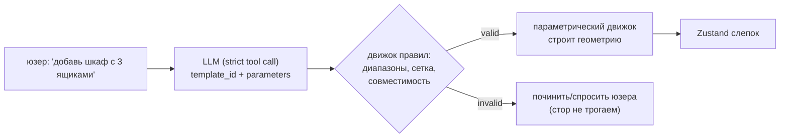
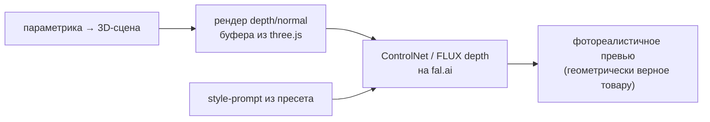

# AI-стратегия планировщика кухни

> Где нейросети реально дают ценность, а где это хайп. Документ для планирования:
> простым языком, с разделением «готово к проду сегодня» vs «research-stage».
>
> Связанные доки: [catalog-architecture.md](catalog-architecture.md) ·
> [parametric-catalog-research.md](parametric-catalog-research.md) (источники, §5) ·
> [kitchen-data-model.md](kitchen-data-model.md) (AI-контракт §9) · [roadmap-product.md](roadmap-product.md)

---

## Главный принцип

> **Параметрический движок каталога — источник истины. AI — ускоритель поверх него, а не замена.**

Из этого следует всё остальное. LLM **не изобретает геометрию** — он выбирает наш шаблон и заполняет параметры. Диффузионные модели **не определяют товар** — они красиво показывают то, что уже однозначно задано параметрами. Так мы получаем скорость нейросетей без их главного минуса — недетерминированности и «галлюцинаций» в том, что должно быть точным.

---

## Три роли AI (все ложатся на гибридную модель каталога)

| # | Роль | Когда работает | Зрелость | Главная ценность |
|---|---|---|---|---|
| 1 | **Наполнение каталога** | dev-time (мы) | ✅ готово | Скорость вариаций, импорт данных |
| 2 | **Ассистент в приложении** | runtime (юзер) | ✅ готово | Редактирование голосом/текстом |
| 3 | **Генеративная визуализация** | runtime (юзер) | ✅ готово | Фотопревью «как будет» |

---

## Роль 1 — Dev-time: наполнение каталога

**Задача:** превратить «руками рисовать по GLB на SKU» в «описал шаблон — получил тысячи вариаций».

Где AI ускоряет:

- **Генерация определений шаблонов и пресетов.** LLM по прайс-листу/описанию производителя предлагает черновик `CabinetTemplate` (параметры, диапазоны) и список `CatalogPreset` (фикс-значения). Человек проверяет — это на порядок быстрее ручного ввода 60+ записей.
- **Авто-превью каталожных карточек.** Вместо PNG-рендеров вручную — пайплайн «параметрика → картинка» (см. роль 3). Пресет хранит style-prompt, превью генерится пакетно.
- **Импорт и нормализация данных производителя.** Когда дойдём до реальных данных Häcker (формат **IDM**, не OFML — см. [catalog-architecture §2](catalog-architecture.md#2-как-это-решает-индустрия-коротко)), LLM помогает маппить чужую схему на нашу, чистить названия, генерить переводы (`name`/`nameDe` уже есть в схеме).

> ⚠️ Это **инструмент разработчика**, а не фича приложения. Выход AI всегда проходит ревью человеком и наши zod-схемы/правила перед попаданием в каталог.

---

## Роль 2 — Runtime: ассистент-«предлагатель параметров»

### Что есть сейчас

В прототипе AI-ассистент работает по контракту **«полная замена слепка»**: на вход `{message, snapshot, catalog}`, на выход — **целый новый `KitchenSnapshot`** (см. [kitchen-data-model §9](kitchen-data-model.md#9-ai-контракт)). Сейчас это мок ([`features/ai-chat/api/mock-handler.ts`](../src/features/ai-chat/api/mock-handler.ts)).

**Проблема подхода «весь слепок»:** просить LLM вернуть целиком корректный JSON всей кухни — хрупко (легко получить невалидную структуру, дубли id, выдуманные catalogId) и дорого по токенам.

### Куда двигаться: structured outputs + tool-calling

С 2024–2025 оба крупных провайдера **гарантируют схемно-валидный вывод** через constrained decoding. Это фундамент для надёжного ассистента.

- **Anthropic Structured Outputs** (GA): `output_config.format = {type:"json_schema", schema}` и `strict:true` на инструментах. Поддержано на линейке Sonnet/Opus/Haiku 4.5+ — **включая `claude-opus-4-8`, на котором мы работаем.**
- **OpenAI Structured Outputs**: `response_format: json_schema` + `strict:true`.

**Целевой паттерн** — LLM эмитит не весь слепок, а **операции над каталогом**:

```jsonc
// Вместо «верни всю кухню заново» — «вызови инструмент с проверяемыми параметрами»
{
  "tool": "place_module",
  "template_id": "base-drawers",      // ← enum: только наши шаблоны
  "parameters": { "widthMm": 600, "drawerCount": 3, "hingeSide": "L" },
  "runId": "run-1", "offsetMm": 1200,
  "finishId": "white-matt"
}
```

Почему это лучше «свободного JSON»:

- **LLM выбирает из нашего каталога, а не выдумывает.** `template_id` — из enum → невозможно произвести несуществующий тип.
- **Синтаксис гарантирован** грамматикой → исчезает класс «невалидный ответ» и вся retry/parse-машинерия.
- **Дешевле и точнее**: модель меняет, что просили, а не пересобирает всю кухню.

### Критичная оговорка (граница ответственности)

> **Constrained decoding гарантирует синтаксис, но НЕ семантику.** Грамматика Anthropic **не** обеспечивает числовые диапазоны (`minimum`/`maximum`/`multipleOf`), длины строк, рекурсию. Она гарантирует, что ширина — *число*, а `template_id` — из *enum*, но **не** что ширина ∈ [300,1200] и кратна сетке.

Поэтому: **наш движок правил каталога остаётся единственным источником истины и финальным валидатором.** Цепочка:



**Reason-then-emit:** дать модели сначала свободно «подумать» текстом, и только финальные параметры — strict tool call'ом (форсирование схемы на шаге рассуждения снижает точность).

---

## Роль 3 — Runtime: генеративная визуализация (fal.ai)

**Идея:** так как геометрия полностью определяется `template + parameters`, мы можем отрендерить **детерминированный depth/normal/edge-пасс прямо из three.js** и скормить его ControlNet — диффузия дорисует только материалы/свет/стиль поверх *нашей* структуры.



- **fal.ai** уже в зависимостях (`@fal-ai/client`), и есть подсистема `ai-transition` — инфраструктура частично заложена.
- Готовый эндпоинт: `fal-ai/flux-control-lora-depth/image-to-image` принимает prompt + init-картинку + **карту глубины** → «depth → стилизованный рендер».
- **Преимущество перед «просто сгенерь кухню»:** превью **геометрически соответствует** реальному товару (мы дали истинную глубину из 3D, а не угадывали). Пресет = фиксированный style-prompt + настройки ControlNet.

Применения: фотопревью карточек каталога (пересекается с ролью 1), режим «фотореалистичный вид» поверх 3D, маркетинговые рендеры.

> ⚠️ Строгого публичного кейса мебельного производителя именно с depth-ControlNet-каталогом не нашлось (только маркетинг вертикальных SaaS) — обещания «30 сек/фотореализм» считать непроверенными до собственного теста.

---

## Что НЕ брать в ядро (трезвый разбор)

| Технология | Зрелость | Почему не в ядро |
|---|---|---|
| **Image-to-3D** (TRELLIS, Hunyuan3D, Tripo, Meshy) | ✅ зрелое | Даёт **неструктурированные меши** (marching-cubes), не редактируемые параметрические шкафы. Полезно для **ингеста ассетов** (референс из фото/скетча, декор-пропсы), не как конфигуратор. |
| **Text/Image-to-CAD** (CAD-Llama, CAD-GPT, cadrille, FutureCAD) | 🔬 research | Подтверждает нашу *парадигму* (LLM → структурированная параметрическая программа лучше free-form), но это общий машиностроительный CAD, точность ~80%, сильнейшие результаты 2026 непроверены. **Брать архитектуру, не модели.** Наши рукописные шаблоны *уже и есть* та структура, которую эти работы трудно учат. |

---

## Дорожная карта AI (порядок включения)

1. **Сейчас → демо:** оставить мок-ассистента работающим; не ломать.
2. **После слоя пресетов/правил:** перевести ассистента с «замена всего слепка» на **strict tool-calling по каталогу** (`claude-opus-4-8`, Structured Outputs). Это и надёжнее, и дешевле.
3. **Параллельно (dev-time):** скрипты AI-наполнения каталога из прайс-листа + пакетная генерация превью.
4. **Когда есть параметрика:** depth→ControlNet превью на fal.ai (роль 3) как отдельный режим визуализации.
5. **Позже:** импорт реальных данных Häcker (IDM) с AI-помощью в маппинге.

---

## Итог

- **AI — ускоритель поверх параметрического движка, не его замена.**
- **Ассистент:** LLM = «предлагатель параметров» через strict tool-calling (`{template_id, parameters}`), наш движок правил — финальный валидатор. Готово к проду на `claude-opus-4-8`.
- **Наполнение:** AI генерит черновики шаблонов/пресетов и превью — под ревью человека.
- **Визуализация:** depth из three.js → ControlNet на fal.ai = геометрически верные фотопревью.
- **Не в ядро:** image-to-3D (даёт меши) и text-to-CAD (research) — только вспомогательно.
