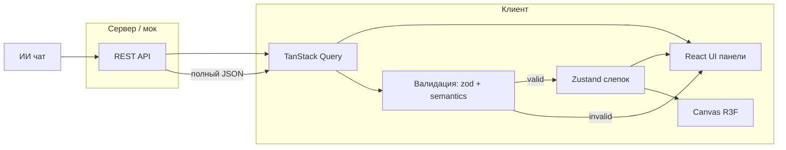

# Архитектура фронтенда: ресерч и обоснование

Документ фиксирует **мейнстримные** подходы для стека прототипа (Vite, React, TS, R3F, Zustand, TanStack Query, Tailwind, Rapier, **@use-gesture/react**, zod) и предлагает **целевую раскладку** под планировщик кухни (2D-план, 3D, data-driven сцена, ИИ).

Связанные документы: [roadmap.md](roadmap.md) (план реализации по фазам), [kitchen-planner-stack.md](kitchen-planner-stack.md), [mobile-first.md](mobile-first.md) (приоритет мобильных показов), [kitchen-data-model.md](kitchen-data-model.md) (иерархия кухни, AI-контракт), [room-plan-and-3d-schema.md](room-plan-and-3d-schema.md) (геометрия комнаты, 2D→3D).

---

## 1. Что считается «мейнстримом» в этом стеке (2024–2025)

### 1.1 Сборка и приложение


| Выбор                   | Почему мейнстрим                                                                                                                                                                |
| ----------------------- | ------------------------------------------------------------------------------------------------------------------------------------------------------------------------------- |
| **Vite**                | Де-факто стандарт для новых React-приложений вместо CRA; быстрый HMR, ESM, нативный TS. Альтернатива с трендом — **Rsbuild** / Rspack; для прототипа Vite — самый частый выбор. |
| **React 18+**           | Concurrent features, строгий режим; экосистема R3F ориентируется на актуальный React.                                                                                           |
| **TypeScript «строго»** | Норма для продукта; для слепка сцены и zod-схем типы обязательны по смыслу задачи.                                                                                              |


**Вывод:** одностраничное приложение (**SPA**) с Vite — типичная точка входа; SSR (Next.js) для прототипа планнера **не обязателен**, если нет SEO и первого байта критичен не сильнее UX редактора.

---

### 1.2 Данные: TanStack Query + Zustand

Официальная позиция TanStack Query: библиотека **не заменяет** клиентский глобальный стор — она закрывает **серверное состояние** (кэш, запросы, инвалидация, ошибки, дедупликация). Клиентское состояние (UI, редактор, сцена в памяти) — **отдельно** ([Does TanStack Query replace Redux?](https://tanstack.com/query/latest/docs/framework/react/guides/does-this-replace-client-state)).


| Слой             | Инструмент         | Что кладём                                                                                                                        |
| ---------------- | ------------------ | --------------------------------------------------------------------------------------------------------------------------------- |
| **Server state** | **TanStack Query** | Каталог, справочники цветов, запросы к API чата (если ответ приходит с сервера), любые GET с кэшем и повторным использованием.    |
| **Client state** | **Zustand**        | Слепок сцены (план, модули, выбор, режим План/3D), то, что **не является** кэшем HTTP и должно жить между действиями без refetch. |


Практика сообщества (статьи и шаблоны): **Zustand + TanStack Query** как пара с чётким разделением — уменьшает смешение «всё в Redux» или «всё в Query» ([пример разделения ответственности](https://volodymyrrudyi.com/blog/separating-concerns-with-zustand-and-tanstack-query/)).

**Для вашего проекта:** слепок сцены **data-driven** — это **клиентская истина** + сериализация для ИИ; каталог и опции цветов — **с сервера (или мок)** → Query. Мутации «отправить чат» — **useMutation**; успешный ответ **полной сцены** → после zod **запись в Zustand** (не держать сцену в кэше Query как основной источник правды).

**Вывод:** разделение **Query / Zustand** — мейнстрим и совпадает с документацией TanStack и типичными R3F-проектами с бэкендом.

---

### 1.3 Трёхмерный слой: React Three Fiber


| Практика                                                                                                 | Обоснование                                                                                       |
| -------------------------------------------------------------------------------------------------------- | ------------------------------------------------------------------------------------------------- |
| **Один корневой `<Canvas>`** на экран редактора (при необходимости — отдельный на вкладку) | **Не цитата из доков**, а частая инженерная практика: один активный WebGL-контекст на экран проще по ресурсам и lifecycle. В официальной документации R3F отдельно зафиксировано другое: хуки вроде [`useThree` / `useFrame`](https://docs.pmnd.rs/react-three-fiber/api/hooks) работают **только внутри** `<Canvas>` — это обязует выносить R3F-компоненты в отдельное поддерево. |
| **Декларативная сцена** — компоненты под `Canvas`, не императивный Three без нужды | Идея R3F — связать React и Three; императив оставляют для ref, порталов, хелперов. |
| **@react-three/drei** | Фактический стандарт: контролы, окружение, helpers. |
| **@use-gesture/react** | Та же экосистема pmndrs: жесты (drag, pinch, wheel) и унификация pointer/touch для UI и кастомного управления сценой; дополняет, а не заменяет, события R3F на мешах ([репозиторий](https://github.com/pmndrs/use-gesture)). |
| **Изоляция кода с `useThree` / `useFrame`** | См. выше: без `Canvas` эти хуки не используются; смешивать с обычным DOM в одном компоненте неудобно и ломает модель. |


**Вывод:** выделить **папку/слой `canvas` / `scene` / `experience`** (название на вкус), куда попадают только R3F-компоненты — это распространённая и здравая граница.

---

### 1.4 Физика: Rapier


| Практика                                                                           | Обоснование                                                                                |
| ---------------------------------------------------------------------------------- | ------------------------------------------------------------------------------------------ |
| **@react-three/rapier** + провайдер вокруг сцены | Официальный путь интеграции Rapier с R3F ([репозиторий](https://github.com/pmndrs/react-three-rapier)). |
| **Согласование единиц** данных, Three и `physics` world | Из доков Rapier/R3F: масштаб задаётся явно; у вас уже зафиксировано в требованиях (мм/см). |
| **Статические коллайдеры** для стен/пола, **kinematic/dynamic** для перетаскивания | Типичное разделение для «расстановки мебели».                                              |


**Вывод:** физика — **поддерево внутри Canvas**, не в Zustand; стор хранит позиции для логики и слепка, симуляция — в кадре/через API Rapier.

---

### 1.5 Валидация и контракты: zod


| Практика                                                       | Обоснование                                                                                    |
| -------------------------------------------------------------- | ---------------------------------------------------------------------------------------------- |
| **Одна схема слепка** — источник для TS (`z.infer`) и рантайма | Снижает расхождение «типы руками» и JSON от ИИ.                                                |
| **Схемы рядом с `entities/scene` или в `shared/schema`**       | Удобно импортировать и на фронте, и в тестах; при появлении общего пакета — вынести в package. |


**Вывод:** zod как **граница доверия** для API и ИИ — мейнстрим в TS-экосистеме.

---

### 1.6 Стили: Tailwind


| Практика                                             | Обоснование                                         |
| ---------------------------------------------------- | --------------------------------------------------- |
| **Утилитарные классы** для панелей, гридов, отступов | Стандарт для быстрых админок и редакторов.          |
| **clsx** / **tailwind-merge** + функция `cn()` | Частый паттерн для условных классов без конфликтов. |


**Вывод:** без отдельного CSS-in-JS для прототипа — норма; тяжёлый UI-kit не обязателен.

---

### 1.7 Организация папок: спектр от «простого» к FSD


| Подход                                                                                  | Когда уместно                                                    |
| --------------------------------------------------------------------------------------- | ---------------------------------------------------------------- |
| Плоско: `components/`, `hooks/`, `stores/`, `lib/` | Малый прототип, быстрый старт. |
| **По фичам `features/planner`, `features/chat`**                                        | Рост кода; колокация UI + хуков + локального API фичи.           |
| **Feature-Sliced Design** (`app`, `pages`, `widgets`, `features`, `entities`, `shared`) | Крупные команды, жёсткие границы импортов; кривая обучения выше. |


**Вывод для кухонного планнера:** мейнстримный компромисс — **гибрид**:

- **`app/`** — провайдеры (QueryClient, Router, опционально ErrorBoundary).
- **`entities/`** (или `model/`) — типы слепка, zod, маппинг слепок → пропсы для сцены.
- **`features/`** — план 2D, каталог+цвет, чат ИИ, переключатель видов (логика + UI).
- **`scene/`** — только R3F: комната, модули, свет, камеры (план/3D), Rapier.
- **`shared/`** — UI-примитивы, `api` клиент, утилиты, `cn`.

Так сохраняется **разделение DOM vs Canvas** и не перегружает старт FSD целиком.

---

## 2. Полная структура папок

Ниже — **целевое дерево** для Vite-проекта. Имена фич можно сузить/переименовать; граница **`scene/` только R3F** — обязательная по смыслу архитектуры.

### Корень репозитория

```text
.
├── public/                      # статика без бандла (favicon, robots — по необходимости)
├── index.html
├── package.json
├── package-lock.json / pnpm-lock.yaml / yarn.lock
├── vite.config.ts
├── tsconfig.json
├── tsconfig.node.json
├── tailwind.config.ts
├── postcss.config.js
├── eslint.config.js
├── .env.example
├── .gitignore
└── README.md
```

### `src/` — приложение

```text
src/
├── main.tsx                     # вход: createRoot, StrictMode
├── main.css                     # Tailwind directives (@tailwind base/components/utilities)
├── vite-env.d.ts
├── app/
│   ├── App.tsx                  # корневой layout маршрута редактора
│   ├── providers/
│   │   ├── AppProviders.tsx     # QueryClientProvider, Router, при необходимости
│   │   └── query-client.ts      # фабрика QueryClient
│   └── routes/                  # при react-router: объявление маршрутов
│       └── routes.tsx
│
├── entities/                    # доменные сущности без «экранного» UI
│   ├── room/                    # геометрия комнаты
│   │   ├── model/
│   │   │   ├── schema.ts        # zod: segments[], openings[], utilities[]
│   │   │   ├── types.ts         # re-export z.infer
│   │   │   └── constants.ts     # дефолты высоты/толщины стен
│   │   └── index.ts
│   │
│   ├── kitchen/                 # кухонный гарнитур (иерархия runs → rows → modules)
│   │   ├── model/
│   │   │   ├── schema.ts        # zod: runs[], countertop, backsplash, plinth
│   │   │   ├── roles.ts         # ModuleRole: 'sink' | 'cooktop' | 'base-drawer' | ...
│   │   │   ├── constraints.ts   # правила размещения (плита не у окна, мойка у стояка)
│   │   │   ├── links.ts         # связи модулей (cooktop → hood)
│   │   │   └── types.ts
│   │   └── index.ts
│   │
│   ├── snapshot/                # корневой слепок (объединяет room + kitchen)
│   │   ├── model/
│   │   │   ├── schema.ts        # zod: KitchenSnapshot { version, room, kitchen, meta }
│   │   │   ├── migrate.ts       # миграции версий
│   │   │   └── validate.ts      # семантическая валидация (поверх zod)
│   │   └── index.ts
│   │
│   └── catalog/
│       └── model/
│           ├── schema.ts        # zod: SKU, габариты, палитра по SKU
│           ├── types.ts
│           └── index.ts
│
├── features/                    # фичи: UI + хуки + локальные запросы
│   ├── editor-shell/            # оболочка редактора: меню, тулбар, переключатель План / 3D
│   │   ├── ui/
│   │   └── model/
│   │       └── editor-store.ts  # Zustand: слепок, выбор, viewMode (или отдельный store в entities/scene)
│   ├── plan-editor/             # 2D: черчение линий, проёмы (двери/окна)
│   │   ├── ui/
│   │   ├── model/
│   │   └── lib/                 # геометрия 2D, привязка к сетке
│   ├── catalog-picker/          # выбор модуля из каталога, цвет
│   │   ├── ui/
│   │   └── api/
│   │       └── catalog-queries.ts   # useQuery каталога (мок → потом API)
│   ├── placement/               # размещение на сцене, drag, поворот (логика + связь со стором)
│   │   ├── ui/
│   │   └── lib/
│   └── ai-chat/                 # панель чата, mutation «отправить», подстановка слепка
│       ├── ui/
│       └── api/
│           └── chat-mutation.ts
│
├── scene/                       # только @react-three/fiber, drei, rapier, @use-gesture/react — без обычного HTML
│   ├── canvas/
│   │   └── SceneCanvas.tsx      # Canvas, Physics, Suspense, режим камеры
│   │
│   ├── room/                    # пол, стены, проёмы из данных room.*
│   │   ├── Room.tsx             # контейнер: Floor + Walls + Openings
│   │   ├── Floor.tsx
│   │   ├── Walls.tsx
│   │   └── Openings.tsx         # визуализация дверей/окон
│   │
│   ├── kitchen/                 # кухонный гарнитур из данных kitchen.*
│   │   ├── KitchenScene.tsx     # контейнер: все runs + islands + appliances
│   │   ├── KitchenRun.tsx       # линия мебели вдоль стены
│   │   ├── ModuleRow.tsx        # ряд (base/wall/tall) внутри линии
│   │   ├── KitchenModule.tsx    # отдельный модуль (меш из каталога)
│   │   ├── Countertop.tsx       # столешница (поверх baseRow)
│   │   ├── Backsplash.tsx       # фартук (между рядами)
│   │   ├── Plinth.tsx           # цоколь (под baseRow)
│   │   └── Appliance.tsx        # отдельностоящая техника (холодильник)
│   │
│   ├── cameras/                 # план: ortho сверху; 3D: perspective
│   │   └── ViewCameras.tsx
│   ├── lights/
│   │   └── SceneLights.tsx
│   └── physics/                 # коллайдеры, при необходимости обёртки Rapier
│       └── colliders.tsx
│
├── shared/
│   ├── api/
│   │   ├── client.ts            # fetch/axios instance, baseURL из env
│   │   └── types.ts             # общие DTO, если не в entities
│   ├── config/
│   │   └── env.ts               # типобезопасные переменные окружения
│   ├── lib/
│   │   ├── cn.ts                # clsx + tailwind-merge
│   │   └── units.ts             # мм ↔ единицы Three
│   ├── mocks/                   # мок каталога и ответов API до бэкенда
│   │   └── catalog.json
│   └── ui/                      # кнопки, панели, layout без бизнес-логики
│       └── ...
│
└── assets/                      # импортируемые ассеты (gltf, hdr — по мере появления)
    └── models/
```

### Структура модулей `scene/`

Каждый модуль сцены (`kitchen/`, `room/`, `intro/`, …) имеет **единообразную внутреннюю структуру**:

```text
scene/<module>/
  index.ts              # barrel: реэкспорт всех подпапок
  components/           # R3F-компоненты верхнего уровня (*Scene.tsx, композиции)
    index.ts
    ...
  meshes/               # отдельные меши с геометрией/материалом (*Mesh.tsx)
    index.ts
    ...
  hooks/                # React-хуки (use*.ts) для логики сцены
    index.ts
    ...
  gizmo/                # интерактивные gizmo, drag-handles
    index.ts
    ...
  lib/                  # чистые функции, константы, типы без React
    ...
  animated/             # Animated-компоненты (react-spring) — опционально
  context/              # React Context + Provider — опционально
  ghost/                # Ghost-превью при drag-n-drop — опционально
```

**Правила:**

| Правило | Описание |
|---------|----------|
| Один компонент — один файл | В `.tsx` не больше одного экспортируемого компонента; логика — в `hooks/` или `lib/` |
| Barrel-экспорты | Каждая папка имеет `index.ts`; корневой `index.ts` реэкспортирует все подпапки |
| Импорты внутри модуля | Относительные (`../hooks`, `./WallMesh`) |
| Импорты между модулями | Только через barrel (`@/scene/kitchen`, не `@/scene/kitchen/meshes/ModuleMesh`) |

### Тесты и качество

Разработка ведётся в стиле **TDD**; подробности и цикл — в [tdd.md](tdd.md).

```text
e2e/                             # Playwright: сценарии редактора
tests/ или src/**/*.test.ts      # Vitest + Testing Library для утилит и схем
```

**Где лежит Zustand:** в примере указан `features/editor-shell/model/editor-store.ts`. Стор хранит:
- `snapshot: KitchenSnapshot` — полный слепок (room + kitchen)
- `viewMode: 'plan' | '3d'` — текущий режим
- `selection` — выбранные объекты
- Действия: `setSnapshot`, `updateModule`, `addRun`, `undo/redo` (опционально)

**Где лежит 2D-план:** `features/plan-editor` — DOM/SVG; данные пишутся в `snapshot.room.segments[]`, читаются в `scene/room/`.

**Где лежит кухня:** `features/kitchen-editor` (UI выбора, добавления модулей) + `scene/kitchen/` (3D-визуализация из `snapshot.kitchen`).

---

## 3. Поток данных (упрощённо)



- Каталог и справочники: **Query → UI**; при добавлении модуля — **обновление Zustand**.
- ИИ: **mutation** → ответ → **zod + семантика** → при успехе **Zustand**; при ошибке — сообщение в UI.

---

## 3.1 AI-контракт

Встроенный AI-помощник работает по принципу **"полная замена слепка"**:

| Этап | Описание |
|------|----------|
| **Вход** | `{ message: string, snapshot: KitchenSnapshot, catalog: CatalogSummary }` |
| **Выход** | `{ snapshot: KitchenSnapshot, explanation?: string, warnings?: string[] }` |
| **Валидация** | 1) `zod.safeParse` — структура; 2) `validateKitchenSemantics` — бизнес-правила |
| **Применение** | Успех → замена стора; ошибка → сообщение, стор не трогать |

**Семантика для AI:**
- AI понимает `role` модулей (`'sink'`, `'cooktop'`, `'base-drawer'`), не только `catalogId`
- Команда "поменяй мойку на шкаф" → AI находит `module` с `role: 'sink'`, меняет `catalogId` и `role`
- Позиция модуля — `offsetMm` вдоль линии, не глобальные (x, y, z)

**Стабильность ID:**
- Каждая сущность имеет `id` (uuid или `<type>-<seq>`)
- AI не меняет `id` без явного удаления/создания
- AI не дублирует `id` в одном слепке

Детали: [kitchen-data-model.md §9](kitchen-data-model.md#9-ai-контракт)

---

## 4. Риски и сознательные решения


| Тема                                          | Рекомендация                                                                                                                                                     |
| --------------------------------------------- | ---------------------------------------------------------------------------------------------------------------------------------------------------------------- |
| **Дублирование позиций** «в сторе и в Rapier» | Явно решить: либо **источник — стор**, физика синхронизируется из стора на шаге, либо на время drag — обратная синхронизация; зафиксировать в коде одним местом. |
| **Два вида (план / 3D)**                      | Одна сцена, **две камеры** или переключение `orthographic` / `perspective` + сохранённый `lookAt`; стор хранит `viewMode`.                                       |
| **2D черчение**                               | Либо SVG/canvas **вне** WebGL, либо второй слой под орто-камерой; данные линий — в слепке, не в Three-объектах как единственная копия.                           |
| **Валидация кухни** | Двухуровневая: 1) **zod** — структура JSON; 2) **семантика** — бизнес-правила (плита не у окна, мойка у стояка, связи модулей). Правила в `entities/kitchen/model/constraints.ts`. |
| **Иерархия vs плоский список** | Модули **не** в плоском `placement.modules[]`, а в иерархии `kitchen.runs[].baseRow.modules[]`. Позиция — `offsetMm` вдоль линии. Столешница — атрибут линии, не модуль. |
| **Неизвестные catalogId от AI** | Не ломать стор: fallback-отображение (placeholder-меш) + warning в UI; валидация catalogId в `entities/snapshot/model/validate.ts`. |


---

## 5. Итог: что считать «каноном» для старта

1. **Vite + React + TS**, SPA без SSR для прототипа.
2. **TanStack Query** — сеть и кэш; **Zustand** — слепок редактора и UI-режимы.
3. **Отдельный слой `scene/`** для R3F + Rapier + drei + **@use-gesture/react** (жесты для drag/pinch и mobile-first).
4. **zod + семантическая валидация** на границе слепка и ответов ИИ.
5. **Папки** — см. [§2](#2-полная-структура-папок): `app`, `entities` (room, kitchen, snapshot, catalog), `features`, `scene`, `shared`.
6. **Tailwind** + при необходимости `cn()`.
7. **Иерархия данных**: `KitchenSnapshot` → `room` (геометрия) + `kitchen` (runs → rows → modules). Детали: [kitchen-data-model.md](kitchen-data-model.md).
8. **AI-контракт**: полный слепок на вход/выход, семантические роли модулей, стабильные ID.

Дальше при росте можно ввести **ESLint boundaries** (import rules) между `scene` и `features`, чтобы не тянуть DOM в R3F и наоборот.

---

## 6. Ссылки на первоисточники и ориентиры

**Внутренние документы:**
- [kitchen-data-model.md](kitchen-data-model.md) — иерархия кухни, семантика модулей, AI-контракт
- [room-plan-and-3d-schema.md](room-plan-and-3d-schema.md) — геометрия комнаты, 2D→3D маппинг

**Внешние источники:**
- TanStack Query — [Client vs server state](https://tanstack.com/query/latest/docs/framework/react/guides/does-this-replace-client-state)  
- React Three Fiber — [документация](https://docs.pmnd.rs/react-three-fiber/getting-started/introduction), разделы про Canvas и хуки  
- `@react-three/rapier` — README репозитория pmndrs  
- `@use-gesture/react` — [репозиторий pmndrs](https://github.com/pmndrs/use-gesture)

*Примечание:* «Мейнстрим» здесь — согласование **документации вендоров**, частых открытых шаблонов R3F и практики React-приложений с разделением server/client state, а не один «золотой» репозиторий на GitHub.