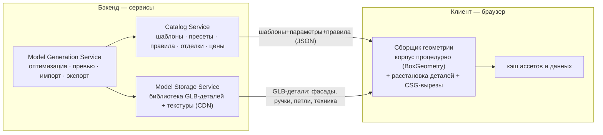

# Бэкенд-сервисы и где живёт геометрия

> Отвечает на вопрос: **модели отдаёт бэкенд готовыми (GLB/OBJ) или геометрия
> собирается на клиенте?** Плюс — какие сервисы нужны (хранение, генерация,
> каталог) и как они связаны. Простым языком.
>
> Связанные доки: [catalog-architecture.md](catalog-architecture.md) ·
> [ai-strategy.md](ai-strategy.md) · [roadmap-product.md](roadmap-product.md)

---

## 0. Важная рамка: прототип — это референс, а не фундамент

Текущий прототип — **разведка боем**: он доказал UX, формат данных и параметрические
идеи. Но он мог быть выстроен «как пойдёт», и **строить продакшн прямо на его коде не
обязательно**. Из прототипа переносим **идеи и форму данных**, а не структуру кода.
Архитектуру ниже стоит читать как **целевую** (можно реализовать заново), а не как
«достроить поверх прототипа».

---

## 1. Главный вопрос: где собирается геометрия шкафа?

Три возможных ответа:

| Подход | Что происходит | Вердикт |
|---|---|---|
| **Бэкенд печёт готовый GLB на каждую конфигурацию** | Меняешь ширину → запрос на сервер → сервер собирает и отдаёт целый GLB | ❌ Это тот же «GLB на SKU», только на сервере: комбинаторный взрыв + round-trip на каждое движение слайдера. Убивает интерактивность. |
| **Всё на клиенте, бэкенда нет** | Клиент и собирает геометрию, и хранит ассеты локально | ⚠️ Не масштабируется на большой каталог и команду: некуда класть библиотеку ассетов, прайс, правила; нет версионирования и обновлений без релиза. |
| **Гибрид (рекомендуем)** | Клиент **собирает** корпус процедурно и **расставляет** готовые детали; бэкенд **хранит и отдаёт** детали-ассеты + данные каталога | ✅ Интерактивно (сборка локально, без round-trip), масштабируемо (ассеты/данные централизованы, версионируются) |

**Рекомендация: гибрид.**

**Кто что делает:**
- **Корпус** (боковины/полки/задник) — простая геометрия, **генерируется на клиенте** из параметров мгновенно. Гонять его через сервер незачем.
- **Детали** (профильные фасады, ручки, петли, ножки, техника) — авторятся один раз как **GLB и хранятся на бэкенде**, клиент их кэширует и инстансит.
- **Данные** (шаблоны, пресеты/SKU, правила, отделки, цены) — приходят с **Catalog Service**.

---

## 2. GLB или OBJ?

Короткий ответ: **бэкенд отдаёт GLB. OBJ — только как опциональный экспорт, низкий приоритет.**

| Формат | Что это | Когда |
|---|---|---|
| **GLB** (бинарный glTF) | Веб-стандарт 3D: один бинарный файл, PBR-материалы, текстуры, сжатие геометрии **Draco** и текстур **KTX2**, анимации. three.js грузит нативно. | ✅ **Всё, что отдаётся в браузер** — детали-ассеты, текстуры. |
| **OBJ** | Древний текстовый формат: нет PBR-материалов (только примитивный MTL), нет сжатия, нет графа сцены. | ⚠️ Только если внешний инструмент (CAD/производство) требует. Для производства актуальнее **STEP / DXF / 3MF**, не OBJ. |

**Когда бэкенд всё-таки печёт целую модель** (это **экспорт**, не интерактивный путь):
- **Экспорт конфигурации** в GLB (для AR/шаринга) или в CAD-формат (STEP/DXF/3MF) для передачи на производство.
- **Превью-картинки** каталога (через Model Generation Service: depth → ControlNet, см. [ai-strategy](ai-strategy.md)).
- **Fallback** для слабых клиентов: запечённое изображение/модель.

---

## 3. Сервисы

### 3.1 Catalog Service (данные)
Отдаёт и версионирует **контент каталога**: параметрические шаблоны, пресеты (SKU),
правила, палитру отделок/материалов, цены. Клиент тянет и кэширует (TanStack Query).
Источник наполнения: ручной + AI-черновики + (позже) импорт IDM Häcker.

### 3.2 Model Storage Service (ассеты)
Хранит и раздаёт **библиотеку GLB-деталей** (фасады, ручки, петли, ножки, техника) и
текстуры, **через CDN** с кэшированием и версиями. Ассеты лежат **оптимизированными**
(Draco + KTX2) — их готовит Generation Service. Это «склад деталей», из которых клиент
собирает любой шкаф.

### 3.3 Model Generation Service (конвейер)
«Фабрика» ассетов и контента — в основном **dev-time**, частично on-demand:
- **Ингест и оптимизация** сырых GLB-деталей (gltf-transform: Draco + KTX2), проверка габаритов против шаблонов.
- **Генерация превью** карточек каталога (рендер depth/normal → ControlNet/FLUX на fal.ai).
- **AI-наполнение**: черновики шаблонов/пресетов из прайс-листа (под ревью). См. [ai-strategy](ai-strategy.md).
- **Импорт и нормализация** данных производителя (IDM Häcker) → в схему Catalog Service.
- **On-demand экспорт** (опционально): запечь целую модель в GLB/STEP/DXF для AR/производства.

> «Сервис генерации моделей» = этот конвейер. Заметьте: **сборка-из-параметров может идти
> и на клиенте** (для интерактива), а Generation Service нужен для тяжёлого/пакетного:
> оптимизация ассетов, превью, импорт, экспорт.

---

## 4. Что на клиенте, что на бэкенде

| Ответственность | Клиент | Бэкенд |
|---|:---:|:---:|
| Сборка корпуса из параметров (интерактив) | ✅ | — |
| Расстановка/инстансинг GLB-деталей | ✅ | — |
| Вырезы CSG (мойка/варка) | ✅ (на коммите) | — |
| Библиотека GLB-деталей + текстуры | кэш | ✅ Storage/CDN |
| Шаблоны, пресеты, правила, цены | кэш | ✅ Catalog |
| Валидация правил | ✅ (UX) | ✅ (истина) |
| Оптимизация ассетов, превью, импорт IDM | — | ✅ Generation |
| Экспорт целой модели (AR/производство) | запрос | ✅ Generation |
| AI-ассистент (tool-calling) | UI | ✅ (LLM) |

**Правило валидации в двух местах:** клиент валидирует для мгновенного UX, бэкенд —
как источник истины (нельзя доверять только клиенту для заказа/цены).

---

## 5. Открытые решения

| Вопрос | Заметка |
|---|---|
| Стек бэкенда | Не зафиксирован. Подойдёт что угодно с REST/JSON + объектным хранилищем + CDN. AI-конвейер — отдельные воркеры. |
| Где параметрика-«движок» как единый код | Идеально — общий пакет (TS), переиспользуемый и на клиенте (сборка), и на бэке (валидация/экспорт). |
| Хранилище ассетов | Объектное (S3-совместимое) + CDN; версии по контент-хэшу. |
| Экспорт в производство | Формат уточнить с Häcker (STEP/DXF/3MF), не раньше параметрического ядра. |

---

## Итог

- **Геометрия собирается на клиенте; бэкенд хранит детали и данные** — гибрид. Бэкенд **не** печёт целый GLB на каждую конфигурацию (это старый «GLB на SKU» на сервере).
- **Отдаём GLB** (Draco/KTX2). **OBJ** — лишь опциональный экспорт; для производства скорее STEP/DXF.
- Три сервиса: **Catalog** (данные), **Model Storage** (GLB-детали/CDN), **Model Generation** (оптимизация/превью/импорт/экспорт).
- Прототип — **референс**: переносим идеи и форму данных, продакшн-архитектуру строим как целевую.
