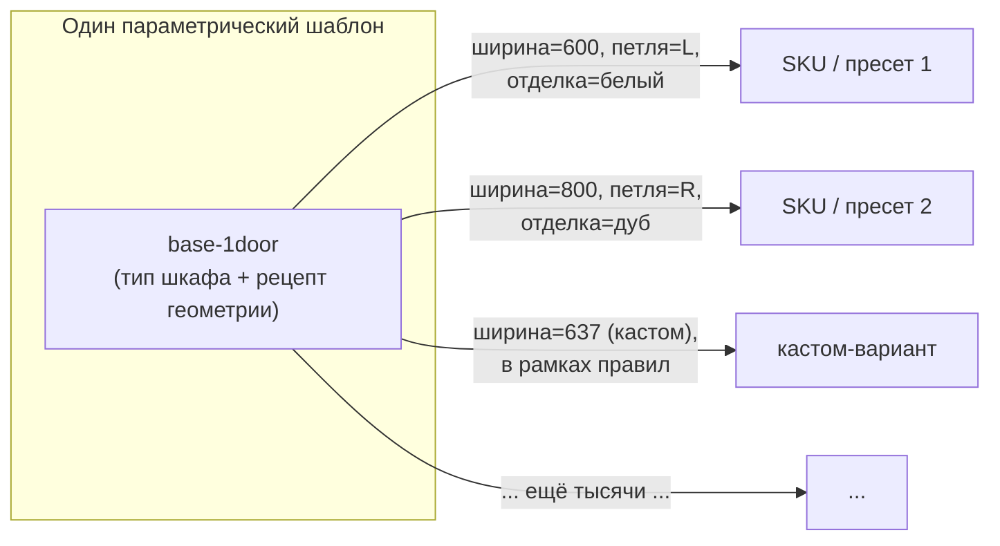
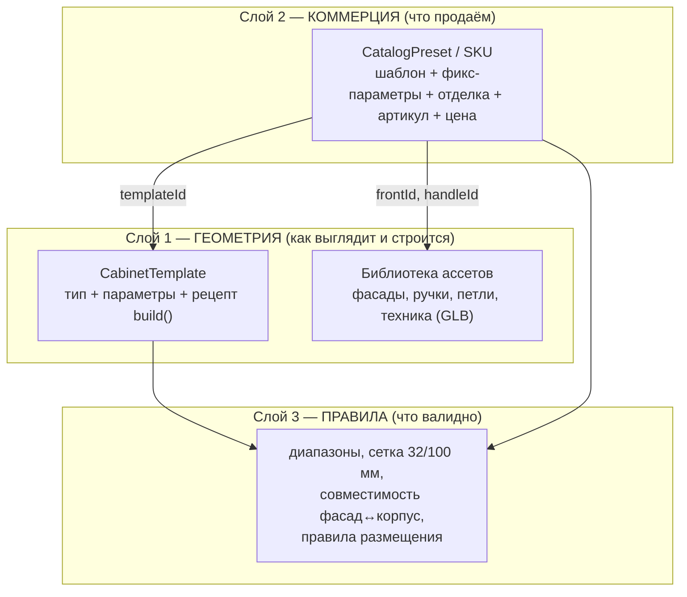

# Архитектура каталога модулей: как создаются и каталогизируются шкафчики

> **Это центральный архитектурный документ.** Он отвечает на главный вопрос:
> *как мы создаём, храним и масштабируем кухонные модули (шкафы) так, чтобы
> быстро делать много вариаций — а не лепить руками по файлу на каждую.*
>
> Документ написан **простым языком, в том числе для тех, кто не знает наш код**.
> Технические термины поясняются по ходу. Глубокий ресерч с источниками вынесен в
> [parametric-catalog-research.md](parametric-catalog-research.md) — здесь только
> выводы и решения.
>
> Связанные доки: [ai-strategy.md](ai-strategy.md) · [tech-debt.md](tech-debt.md) ·
> [roadmap-product.md](roadmap-product.md) · [kitchen-data-model.md](kitchen-data-model.md) ·
> [architecture.md](architecture.md)

---

## 0. Словарик (чтобы дальше было понятно всем)

| Термин | Простыми словами |
|---|---|
| **Модуль / юнит** | Один кухонный элемент: шкаф, пенал, мойка, духовка. |
| **SKU / артикул** | Уникальный код товара в прайс-листе. «То, что можно заказать у завода». |
| **Корпус (carcass)** | «Коробка» шкафа: боковины, верх/низ, задняя стенка, полки. Без дверей. |
| **Фасад (front)** | Дверь или передняя панель ящика. Отдельная деталь — её можно менять. |
| **Фурнитура (hardware)** | Петли, направляющие ящиков, ручки, ножки, цоколь. |
| **Отделка (finish)** | Цвет/материал поверхности (белый мат, дуб, антрацит…). |
| **GLB** | Файл готовой 3D-модели (как «фотография» геометрии). Сейчас по файлу на SKU. |
| **Процедурная геометрия** | 3D-модель, которую строит **код по числам** (ширина/высота/число ящиков), а не художник в Blender. |
| **Параметр** | Настраиваемое число/выбор модуля: ширина, высота, сторона петли, число ящиков. |
| **Шаблон (template)** | «Тип шкафа» + рецепт, как из параметров построить геометрию. Один шаблон = тысячи вариаций. |
| **Пресет (preset)** | Готовая, заранее проверенная комбинация: шаблон + зафиксированные параметры + отделка. Это и есть «товар из каталога» (SKU). |
| **Правило (rule)** | Ограничение: «ширина от 300 до 1200 с шагом 100», «петля либо слева, либо справа», «мойке нужен слив рядом». |

**Одно предложение, которое держит всю идею:**
> Мы перестаём хранить **тысячи готовых файлов** и начинаем хранить **десятки шаблонов + правила**, а конкретные шкафы (и товары, и кастом) **порождаются из них на лету**.

---

## 1. Проблема: почему «один GLB на SKU» не масштабируется

### Что сейчас

Каталог — это захардкоженный список из **61 модуля** в [`src/shared/mocks/catalog.ts`](../src/shared/mocks/catalog.ts) (файл на ~900 строк). Каждая запись жёстко указывает на **статичный GLB-файл** (всего ~59 разных файлов) и PNG-превью:

```ts
{
  sku: 'base-cabinet-600-1door-L',     // 600 мм, дверь слева
  role: 'base-cabinet',
  widthMm: 600, heightMm: 680, depthMm: 520,
  modelUrl: '/models/Cabinets/Cabinet_bottom_600_1door_L.glb',  // ← отдельный файл
  thumbnailUrl: '/icons/Cabinet/Cabinet_bottom_600_1door_L.png',
}
```

Чтобы получить «то же, но дверь справа» или «то же, но 800 мм» — нужен **новый файл в Blender, новое превью, новая строка**.

### Почему это тупик

Реальный шкаф — это пересечение нескольких независимых осей. Посчитаем для **одного** простого нижнего шкафа:

| Ось | Примеры значений | Кол-во |
|---|---|---|
| Ширина | 300/400/450/500/600/800/900/1000/1200 | ~9 |
| Конфиг фасада | 1 дверь L / 1 дверь R / 2 двери / 1–3 ящика / открытый | ~6 |
| Сторона петли | слева / справа | ×2 |
| Отделка | 10 цветов | ×10 |
| Тип ручки | 3–4 | ×4 |

Перемножаем: **9 × 6 × 2 × 10 × 4 ≈ 4300 вариаций — для ОДНОГО семейства шкафов.** И это без пеналов, верхних, угловых, моек, техники. При подходе «файл на SKU» это физически нерисуемо: тысячи GLB-файлов, ручной труд художника на каждую, гигабайты ассетов, рассинхрон между прайсом и моделями.

> 📌 Именно эту боль вы и описали. И именно её все проф-планировщики решили **одинаково** — см. §2.

### Дополнительные проблемы текущего подхода (из обзора кода)

- **Нет кастома.** Häcker допускает нестандартные размеры — а у нас нет способа сделать шкаф 637 мм без нового файла.
- **Хрупкие тесты.** SKU-строки (`'base-sink-800'`, `'stove-800'`) захардкожены в 14+ тест-файлах → переименование каскадит.
- **Нет связи с прайсом.** Габариты есть, цены/опций/вариант-кодов нет — а для производителя это и есть суть каталога.
- **Нет версионирования каталога.** Добавить поле или снять SKU с производства нечем.

Полный список — в [tech-debt.md](tech-debt.md) (пункт #1).

---

## 2. Как это решает индустрия (коротко)

Главный вывод ресерча: **вся профессиональная индустрия (2020 Design/Cyncly, Compusoft Winner, Carat, KD Max, ArtiCAD, IKEA, стандарты OFML и IDM) моделирует шкаф как «параметрический шаблон + параметры + слой правил», а не как фиксированный меш на каждый SKU.** Наша гибридная идея — это отраслевой мейнстрим, а не эксперимент.

Два урока, критичных для нас:

1. **Данные строятся слоями** (так устроены и офисный стандарт OFML, и кухонный IDM):
   - **геометрия** (параметрическая),
   - **коммерция** (цена, артикул, опции),
   - **правила** (что с чем сочетается, диапазоны).
   Слои связаны через идентичность артикула. SKU **порождаются** из конфигурации (variant-код), а не перечисляются вручную.

2. **Поправка про Häcker (важно для будущего импорта).** Распространённое «европейский производитель → OFML/pCon» **для Häcker неверно**. Кухонная отрасль Германии стандартизирована на формате **IDM (Integriertes Datenmodell, экосистема DCC)**, который раздаётся в планировщики **CARAT и KPS**. OFML/pCon — это про *офисную* мебель. Häcker подтверждённо есть в списке производителей CARAT и участвует в DCC.
   - **Что это значит для нас:** если когда-нибудь встанет задача импортировать *реальные* данные Häcker — целевой формат **IDM**, не OFML. Но как референс **архитектуры** оба стандарта идентичны (геометрия + коммерция + правила), и оба подтверждают нашу слоистую модель. Детали и ссылки — в [research §1](parametric-catalog-research.md#1-ofml--pcon--easterngraphics--и-что-на-самом-деле-использует-häcker).



---

## 3. Три варианта архитектуры

### Вариант A — «как сейчас»: статический GLB на каждый SKU

Один файл Blender = одна вариация.

- ✅ Максимальный фотореализм, полный художественный контроль, просто рендерить.
- ❌ Комбинаторный взрыв (см. §1). Ручной труд на каждую вариацию. Нет кастом-размеров. Рассинхрон с прайсом. **Не масштабируется на каталог производителя.**

### Вариант B — полностью процедурная геометрия

Шкаф целиком = код, который строит корпус + полки + фасады + ручки из параметров.

- ✅ Бесконечные вариации почти бесплатно, любой кастом-размер, очень лёгкие данные.
- ❌ Труднее достичь «художественного» фотореализма (профильные фасады, фаски, реалистичная фурнитура). Нужен серьёзный геометрический движок и библиотека фурнитуры. Дольше стартовая разработка. Это путь «maker»-инструментов.

### Вариант C — гибрид: шаблоны + параметры + слой ассетов ✅ РЕКОМЕНДУЕМ

Лучшее из обоих:

- **Корпус генерируется процедурно** (боковины/полки/задник — это просто параметризованные «коробки», их легко строить кодом — см. §5).
- **Сложные детали остаются готовыми ассетами:** профильные фасады, ручки, петли, реалистичная техника — это переиспользуемые маленькие GLB-детали, которые код **расставляет по параметрам** (а не отдельный GLB на весь шкаф).
- **Отделка/цвет — отдельный слой**, применяется *к* геометрии (один материал на палитру), не «запекается» в N×M файлов.
- **SKU производителя = пресет** = шаблон + зафиксированные параметры + отделка + артикул.
- **Кастом = тот же шаблон** с другими значениями параметров **в рамках правил**.

| Критерий | A (GLB на SKU) | B (полностью код) | **C (гибрид)** |
|---|:---:|:---:|:---:|
| Скорость новых вариаций | ❌ ручками | ✅ бесплатно | ✅ бесплатно |
| Кастом-размеры | ❌ | ✅ | ✅ |
| Фотореализм деталей | ✅ | ⚠️ трудно | ✅ (GLB-детали) |
| Привязка к прайсу/SKU | ⚠️ руками | ⚠️ нужно строить | ✅ пресеты=SKU |
| Стартовые трудозатраты | низкие | высокие | **средние** |
| Вес данных | ❌ гигабайты | ✅ крошечный | ✅ малый |
| Совпадает с индустрией | нет | частично | **да (2020/IDM/METOD)** |

> **Почему именно C:** он масштабируется как B, держит качество и привязку к прайс-листу как A, и **один движок закрывает и фикс-линейку Häcker, и кастом.** Именно так устроены 2020 Design / Cyncly-Winner / KD Max / IKEA METOD: «типы шкафов» + параметры + отдельные каталоги фасадов/фурнитуры/материалов.

---

## 4. Рекомендуемая модель данных (гибрид, слоями)

Повторяем структуру OFML/IDM: **три слоя, связанные идентичностью артикула.**



### 4.1 Слой геометрии: `CabinetTemplate`

«Тип шкафа» + рецепт, как из параметров построить геометрию. Эскиз (форма, не финальный код):

```ts
interface CabinetTemplate {
  id: string;                 // 'base-1door', 'base-drawers', 'wall-2door', 'tall-oven'...
  kind: 'base' | 'wall' | 'tall' | 'corner' | 'appliance' | 'static-mesh';
  role: ModuleRole;           // существующая семантика для AI (sink, cooktop, ...)
  params: ParamDef[];         // что можно крутить
  rules: Rule[];              // ограничения (см. слой 3)
  build(params): GeometryPlan;// рецепт: чистая функция параметры → план геометрии
}

interface ParamDef {
  key: string;                // 'widthMm', 'doorCount', 'hingeSide', 'drawerCount'
  type: 'number' | 'enum' | 'bool';
  default: unknown;
  min?: number; max?: number; step?: number;  // для number (step = сетка)
  options?: string[];                          // для enum
}

interface GeometryPlan {
  panels: Panel[];            // процедурные «коробки» корпуса (boxgeometry)
  assets: AssetPlacement[];   // GLB-детали: фасад, ручки, петли, техника + трансформ
  cutouts: Cutout[];          // вырезы (мойка/варка/отверстия) для CSG
}
```

Ключевая мысль: `build()` — **чистая функция** `параметры → план геометрии`. Её легко тестировать (числа на вход, числа на выход, без WebGL) и легко вызывать из AI-слоя.

### 4.2 Слой коммерции: `CatalogPreset` (= наш будущий SKU)

```ts
interface CatalogPreset {
  sku: string;                // стабильный артикул производителя (для заказа)
  displayCode: string;        // отображаемый код (можно пересчитывать при ресайзе)
  templateId: string;         // на какой шаблон ссылается
  params: Record<string, unknown>;  // зафиксированные значения параметров
  frontStyleId?: string;      // линейка/стиль фасада (ортогональный слой)
  finishId?: string;          // отделка (ортогональный слой)
  handleId?: string;          // ручка (ортогональный слой)
  price?: PriceRule;          // база + надбавки по свойствам (подключаемо)
  thumbnailUrl?: string;      // может генерироваться AI (см. ai-strategy)
}
```

- **Пресет = именованная, заранее проверенная точка** в пространстве вариантов шаблона. Это «товар из каталога».
- **Стиль фасада / отделка / ручка — ортогональные слои** поверх корпуса (блюпринт — IKEA METOD: «корпус продаётся отдельно, двери/ручки/петли отдельно»). Не плодим N×M — применяем отделку *к* геометрии.

### 4.3 Слой правил: `Rule`

Правила — **первоклассная сущность**, а не разбросанные `if`. Часть уже есть в коде ([`entities/kitchen/model/constraints.ts`](../src/entities/kitchen/model/constraints.ts), `PLACEMENT_RULES`, `MODULE_LINKS`). Добавляем правила уровня шаблона:

- **Диапазоны параметров:** ширина ∈ [300, 1200].
- **Сетка:** ширина кратна 100 (низ — 50) мм; высоты фасадов = `32·k − зазор`; отверстия по «системе 32 мм» (передний ряд 37 мм, всё на `37 + 32·n`). Эта сетка превращает размещение фурнитуры в чистую арифметику — см. [research §3.3](parametric-catalog-research.md#33-система-32-мм--системные-отверстия--движок-размещения).
- **Совместимость:** какие фасады/ручки подходят к корпусу; сторона петли ∈ {L, R}.
- **Размещение (есть):** плита не у окна, мойке нужен слив, плите нужна вытяжка.

> **Пресет — это заранее провалидированная точка в пространстве правил.** Кастом — любая другая точка, которую правила пропускают.

### 4.4 Как это ложится на текущую модель

Хорошая новость: **существующий `CatalogItem` — это частный случай новой модели.** Сегодняшний «GLB на SKU» — это просто `CabinetTemplate` вида `kind: 'static-mesh'` (рецепт = «загрузить этот GLB») + пресет с фиксированными габаритами. Значит, **мигрировать можно по частям, не ломая всё сразу** (см. §6). Иерархия слепка (`run → row → module`, позиция = `offsetMm`) и роли модулей **остаются без изменений** — меняется только то, *откуда берётся геометрия модуля*.

---

## 5. Как это рендерится (и почему это лечит наш фриз)

Гибрид C на three.js — проверенный паттерн (Codrops-кейс процедурного кухонного дизайнера, конфигуратор Salsita). Практические решения:

- **Корпус = параметризованные `BoxGeometry`-панели.** Боковины/полки/задник — это коробки, позиционируемые по ширине/высоте/толщине (по умолчанию **18 мм** — мастер-офсет: внутренняя ширина = внешняя − 2×толщина).
- **Сложные детали — маленькие общие GLB** (фасады с профилем, ручки, петли, техника), расставляются по параметрам и инстансятся. `InstancedMesh` для идентичных повторов (ручки, петли, полкодержатели) — это **один draw call** на тысячу деталей. Цель сцены — **< 100 draw calls/кадр**.
- **Async-подмена за плейсхолдером:** пока грузится GLB-деталь, показываем серый бокс (у нас уже есть `ModuleBoxMesh`-fallback — это та же философия).
- **Вырезы (мойка/варка/петли)** — через `three-bvh-csg` (`SUBTRACTION`/`HOLLOW`), резать **один раз на коммите**, не на каждый тик слайдера; кэшировать.
- **Текстура дерева** — сэмплировать по мировой позиции (triplanar), иначе box-UV растягивает волокно на панелях разного размера.

### 🔥 Прямая связь с нашим багом фриза

Производительность определяют **материалы и шейдеры, а не полигоны.** Каждая уникальная комбинация «материал + текстуры + свет + тени» компилирует отдельную GPU-программу, и первый её рендер = видимый фриз. Это ровно наш [`shader-compile-freeze-transitions`](../../.claude/projects/C--UnityProject-Kitchen/memory/shader-compile-freeze-transitions.md). Лекарства, которые **становятся естественными** в модели C:

1. **Малая фиксированная палитра общих `MeshStandardMaterial`** (параметр → материал по словарю). Меньше программ + лучше батчинг. Самый высокорычажный пункт.
2. **Плейсхолдер-текстуры вместо `null`** (общие шейдер-константы).
3. **Прогрев `renderer.compileAsync()`** перед показом новой геометрии.
4. **`dispose()`** генерируемой геометрии/материалов на каждой пересборке; поставляемые GLB — Draco + KTX2.

> Полевой кейс из ресерча: сцена компилировалась 3.5 с → **0.85 с** после перехода на общие `MeshStandardMaterial` + плейсхолдер-текстуры. Подробности — [research §4.3](parametric-catalog-research.md#43-процедурная-геометрия-vs-glb-на-sku--компромиссы).

То есть переход к C — не только про каталог, но и **структурное лекарство** от уже известной проблемы производительности.

---

## 6. План миграции от текущего состояния

Не переписываем всё. Двигаемся **семействами модулей**, начиная с самого «комбинаторно-тяжёлого».

```mermaid
flowchart LR
  S0["Сейчас:<br/>61 SKU = 61 GLB"] --> S1
  S1["Шаг 1: ввести слой шаблонов<br/>static-mesh обёртка над текущими GLB<br/>(каталог не меняется визуально)"] --> S2
  S2["Шаг 2: первый процедурный шаблон<br/>base-1door / base-drawers<br/>(самое тяжёлое семейство)"] --> S3
  S3["Шаг 3: слой пресетов + правил<br/>SKU = шаблон + params + отделка"] --> S4
  S4["Шаг 4: остальные семейства<br/>wall / tall / corner"] --> S5
  S5["Шаг 5: кастом-размеры<br/>+ AI-наполнение + AI-превью"]
end
```

1. **Слой шаблонов (рефактор без новых фич).** Завернуть текущий `CatalogItem` в `CabinetTemplate{kind:'static-mesh'}`. Внешне ничего не меняется, но появляется единая точка, через которую модуль получает геометрию. Заодно — фабрики для тестов вместо захардкоженных SKU-строк (закрывает долг хрупких тестов).
2. **Первый процедурный шаблон.** `base-1door` + `base-drawers` (нижние шкафы — самое тяжёлое семейство). Чистая функция `build()` под тестами. Это и есть «вертикальный срез» для демо «вживую».
3. **Слой пресетов + правил.** SKU становится пресетом; вводим диапазоны/сетку/совместимость. Прайс — подключаемым слоем (заглушка).
4. **Остальные семейства:** верхние, пеналы, угловые (угловые сложные — допускаем fallback в статичный меш, как делает KD Max).
5. **Кастом-размеры + AI:** разблокировать нестандартные размеры в рамках правил; включить AI-наполнение каталога и AI-превью (см. [ai-strategy.md](ai-strategy.md)).

**Принцип:** каждый шаг оставляет приложение рабочим и показываемым. Подробные сроки — в [roadmap-product.md](roadmap-product.md).

---

## 7. Где здесь AI (кратко, детали — в ai-strategy.md)

Три роли, все ложатся на модель C:

1. **Dev-time — наполнение каталога.** LLM/скрипты порождают определения шаблонов и пресетов из прайс-листа; авто-генерация превью; импорт/нормализация данных производителя (в будущем — IDM).
2. **Runtime — ассистент.** LLM работает **«предлагателем параметров»**, не генератором геометрии: через strict tool-calling эмитит `{ template_id (enum), parameters }`, а наш движок правил валидирует и строит. Это надёжнее текущего «свободный JSON-слепок».
3. **Runtime — генеративная визуализация.** Рендерим depth/normal из three.js → ControlNet/FLUX на fal.ai → фотореалистичное превью «как будет выглядеть». Геометрию владеет параметрика, внешний вид — диффузия.

> Ключевой принцип: **параметрический движок — источник истины, AI — ускоритель.** LLM не изобретает геометрию, а заполняет параметры известных шаблонов; constrained decoding гарантирует синтаксис, но числовые диапазоны и снап к сетке — всё равно наш движок правил.

---

## 8. Открытые вопросы и сознательно отложенное

| Вопрос | Статус / решение |
|---|---|
| Угловые модули (трапеция, 45°, карусель) | Сложная геометрия — на первом этапе допускаем fallback в статичный GLB (как KD Max). |
| Политика «правка шаблона → размещённые экземпляры» | Решить явно: распространять правки или нет (у KD Max — НЕ распространяются, нужно переприменять). |
| Прайс-слой | Подключаемый: и SKU-привязанные прайс-листы, и расчёт «площадь×материал». Пока заглушка. |
| Импорт реальных данных Häcker | Целевой формат — **IDM (DCC)**, не OFML. Отдельная большая задача, не для прототипа. |
| Внутреннее наполнение (полки/выкатные) | Параметр шаблона позже; пока модуль — единое целое. |
| Triplanar-текстуры дерева | Нет в ядре three.js — шейдер-аддон/`onBeforeCompile`. Отдельная задача качества. |

---

## Итог

- Уходим от **«файл на SKU»** к **«шаблон + параметры + правила»** (вариант C, гибрид).
- Модель — **три слоя**, как в индустриальных стандартах OFML/IDM: геометрия / коммерция / правила.
- **Корпус процедурно, детали — GLB-ассеты, отделка — отдельный слой**; SKU = пресет, кастом = тот же шаблон в рамках правил.
- Миграция — **по семействам, не ломая всё**; текущий GLB-каталог становится частным случаем (`static-mesh`).
- Переход заодно **структурно лечит фриз компиляции шейдеров**.
- AI — **ускоритель поверх движка** (наполнение, ассистент-«предлагатель параметров», превью), а не замена параметрики.
