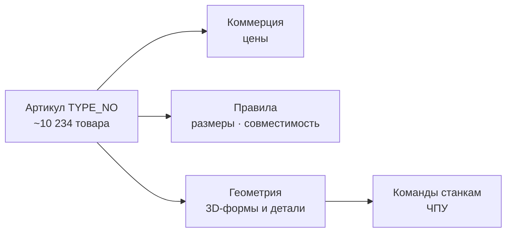
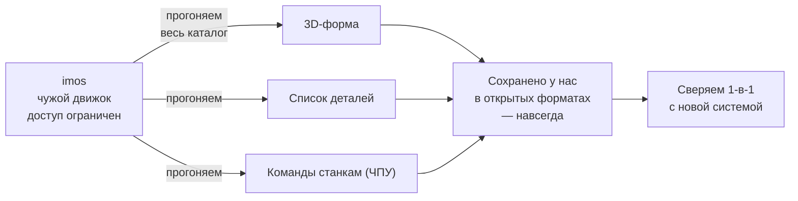
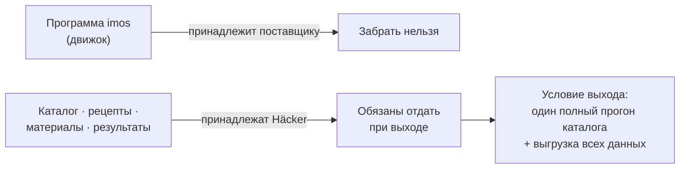

# Миграция Häcker — куда и как переносим

Häcker сегодня работает на трёх старых системах. Эта страница объясняет простыми словами:
что именно лежит в их данных, что переносится легко, а что тяжело, и как мы гарантируем,
что на заводе после перехода всё сойдётся **один в один**.

> Главный вывод анализа: каталог, цены и правила переносятся легко и надёжно. 3D-формы и
> команды для станков — самое тяжёлое, и часть из них в выгрузке вообще отсутствует. А один
> из трёх «китов» — стандарт **IDM** — это не их личная программа, а общий формат отрасли:
> от него не уходят, его продолжают отдавать наружу.

## Коротко

- В папке-выгрузке Häcker — **не 3D-модели кухонь, а каталог с ценником**: ~**10 234 товара**,
  цены, правила и допустимые размеры.
- **Уходим от двух систем из трёх:** хранилища 3D (**Navigram**) и редактора (**imos**).
  **IDM** — отраслевой стандарт — **сохраняем** и продолжаем отдавать дилерам.
- **Лёгкая часть** (делаем первой): каталог, цены, правила — у каждого товара чистый
  номер-артикул, всё сходится на **99.9%**.
- **Тяжёлая часть** (делаем аккуратно и последней): 3D-формы шкафов и команды для станков.
- **«Гарантированно» = проверяемо:** сверяем старую и новую систему на реальных заказах,
  переключаем по частям и обратимо.

## Что у Häcker есть сейчас

| Система | Что это простыми словами | Что делаем |
|---|---|---|
| **IDM** | Общий каталог-стандарт: товары, цены, правила | **Оставляем** как канал наружу + свой каталог у себя |
| **imos** | Сложный редактор: 3D-формы шкафов и команды станкам | **Делаем своё** — сборщик геометрии в браузере |
| **Navigram** | Облачное хранилище 3D-моделей для показа | **Делаем своё** — хранилище 3D с быстрой доставкой |

**Важный нюанс про IDM.** Это не программа Häcker, а **отраслевой стандарт обмена данными**
(IDM, «Integriertes Datenmodell», поддерживается DCC). По нему мебельные магазины Европы
планируют кухни в своих программах (CARAT, KPS). Поэтому «уйти от IDM» нельзя и не нужно:
новая система **продолжает его выдавать наружу**, а внутри хранит мастер-данные у себя.

## Что лежит в их данных на самом деле

Большой файл выгрузки (92 МБ) выглядел как «модель», но это **каталог-прайс в формате IDM**
(`T_NEW_CATALOG`, схема `IDM_3_0_1`, производитель 71, «concept130 2026 national», DE/EUR).
Внутри — **ноль геометрии и ноль команд для станков**: только товары, цены, правила и
габаритные «конверты» (какие размеры допустимы).

А вот самое ценное из imos — как именно собирается шкаф и как его режут станки — в выгрузку
**почти не попало**. Формы живут в скриптах редактора, а команды станкам — в его
постпроцессоре, которого в выгрузке нет вовсе.

## Карта данных: всё держится на артикуле

Хорошая новость в том, что данные Häcker **аккуратно связаны одним ключом — номером-артикулом**
(`TYPE_NO`). По нему каталог, цены, правила и формы сходятся между файлами. Это и делает
миграцию данных надёжной и проверяемой.

**Для технарей.** Универсальный ключ конфигуратора — пара `(feature, option)`, одинаковая во
всех файлах (75 фич, ~3 476 значений опций, 227 правил-ограничений). Мост каталог→геометрия —
кортеж `CARCASE_BASIC_SHAPE_NO / TK_TYPE / TK_CLASS / TK_FRONT_APPEARANCE (+ ≥TYPE_NO)`;
3D-ассеты адресуются через `navCategory` (Navigram). Цены в `priceDefinition.json` хранят не
суммы, а индексы `(SUPPLIER_PRICE_GROUP, PRICE_FIELD)` во внешнюю таблицу IDM. Полная разборка —
в отчётах `HK/_research/01–05.md`.

## Что переносится легко, а что тяжело

**Легко и надёжно — делаем первым (фундамент):**

- **Каталог** — 10 234 товара с чистым артикулом (сходимость 99.9%).
- **Цены** — структура ценообразования по фичам и опциям.
- **Правила** — допустимые размеры, шаг, совместимость опций.

**Тяжело — делаем аккуратно и со сверкой:**

- **3D-формы шкафов** — это скрипты-логика внутри старого редактора (с зависимостями друг от
  друга), а не просто данные. Переносим в наш сборщик геометрии и сверяем форму.
- **Команды для станков (ЧПУ)** — в выгрузке только ссылки на программы, а сами программы — в
  постпроцессоре imos, которого в выгрузке **нет**. Вынимаем из живого imos **до** его
  выключения, иначе часть конфигураций станет невозможно изготовить.

## Как забираем тяжёлую часть из imos

Ключевой нюанс: **imos — чужая программа, движок нам не принадлежит, доступ ограничен и скоро
закроется**. Поэтому стратегия — **не расшифровывать** внутренние «рецепты» сборки (`.nfx`), а
**пока imos работает**, прогнать через него весь каталог и сохранить **готовые результаты** в
открытых форматах. Эти файлы остаются у нас навсегда — даже после отключения imos.

**Четыре шага:**

1. **Прогоняем весь каталог через imos.** По каждому товару сохраняем 3D-форму, список деталей
   (панели, размер, материал) и команды для станков — в наших открытых форматах.
2. **Снимаем в нескольких размерах и опциях.** Минимум/номинал/максимум габаритов + ключевые
   комбинации опций, чтобы восстановить *как товар меняется*, а не один снимок.
3. **Забираем библиотеку рецептов целиком.** `.nfx` ссылаются друг на друга (`hold(...)`) —
   нужна вся библиотека, выборкой нельзя. Держим как справочник и материал для сверки.
4. **Собираем своё и сверяем 1-в-1.** Новую систему гоняем против сохранённых результатов imos
   (форма, состав, команды станку). Совпало — перенос доказан.

**Для технарей.** Форматы: 3D → `STEP` (ISO, вендоро-независимый) + `glTF/GLB` для просмотра;
детали → спецификация (BOM); ЧПУ → нативные форматы станков (`WoodWOP/MPR` Homag/Weeke,
`BPP/CIX` Biesse, `HOP` Holzher, `TCN` TPA, либо G-код), генерирует модуль `iX CAM`. В выгрузке
лежат только хуки `gcode(589, 0.015)` (ссылки на операции), а сами координаты строит постпроцессор
imos в рантайме — поэтому ЧПУ невосстановимо без живого движка. Сохранённый набор работает как
golden-file эталон-оракул для регрессионной сверки новой системы.

## Почему мы вправе это забрать

Разделяем две вещи: **программа** imos принадлежит её поставщику (imos GmbH) — её забрать нельзя.
Но **данные** — каталог, рецепты `.nfx`, материалы и сохранённые результаты расчётов —
принадлежат **Häcker**, и удерживать их при расторжении договора поставщик не вправе.

Поэтому правильный ход — оформить выгрузку как **условие выхода**: поставщик один раз прогоняет
весь каталог и отдаёт все результаты вместе с данными. Это надёжнее и быстрее, чем самим в
урезанном доступе всё успевать вручную.

## Как гарантируем перенос без потерь

«Гарантированно» — это **не обещание на словах, а проверка**:

1. **Считаем всё до последнего.** Берём каждый из 10 234 товаров; 13 несходящихся
   (`EM600–605`, `MP-FAST`, обрубки со слэшем) закрываем вручную — ничего не теряем.
2. **Сверяем старое и новое 1-в-1.** Гоняем реальные заказы через обе системы рядом и сверяем
   результат: размеры, цена, состав, команды станка (golden-file сверка + реконсиляция).
3. **Переключаем по частям и обратимо.** Сначала данные, станки — последними. Каждый шаг
   можно откатить.

## Чем заменяем (аналоги)

| Было (Häcker) | Станет (наша система) |
|---|---|
| imos — редактор и 3D-формы | Сборщик геометрии в браузере (three.js) + точные формы, где нужно |
| imos — команды станкам (ЧПУ) | Держим проверенное, заменяем постепенно после побайтовой сверки |
| Navigram — хранилище 3D | Своё хранилище 3D (GLB на CDN, быстрая доставка) |
| IDM — каталог-стандарт | Свой каталог-сервис у себя **+ продолжаем эмитить IDM наружу** |

## Что это даёт

- **Свои данные.** Товары, цены и 3D живут в вашей системе, а не в аренде у чужого софта.
- **Продажи в браузере.** Конфигуратор открывается на любом устройстве без установки программ.
- **Меньше зависимости.** Открытые форматы вместо одного закрытого — нет привязки к вендору.
- **Масштаб по бизнесу.** Стоимость растёт со спросом, а не с числом купленных лицензий.
- **Меняем каталог сами** — новые шкафы, отделки, правила без очереди к вендору.
- **ИИ помогает безопасно** — заполняет параметры по правилам и не выдумывает геометрию.
- **Один поток данных** от продажи до завода — меньше потерь при передаче.
- **Совместимость сохраняется** — продолжаем отдавать IDM, дилеры работают как раньше.

## Честные риски и допущения (для технарей)

- **Команды для станков — главный риск.** `optionGcodeMapping.json` содержит только вызовы
  макросов вида `gcode(589, 0.015)`; тела программ — в постпроцессоре imos и в выгрузку не
  попали. Их нужно извлечь из живого imos до отключения.
- **3D-формы — это логика, не данные.** `.nfx` — параметрический DSL с графом зависимостей;
  переносим с проверкой формы, а не побайтовым копированием.
- **13 артикулов не сходятся** между файлами — закрыть вручную до заявления «без потерь».
- **Единицы.** В каталоге миллиметры (целые), в геометрии метры (дробные) — следить за
  множителем ×1000, иначе ошибка в 1000 раз.
- **Уточнить у Häcker:** формат их станков (реальный G-код или вендорный, напр. Homag/woodWOP) и
  точный смысл «IDM» (отраслевой стандарт и/или внутреннее приложение). От этого зависит план
  по станкам и постпроцессорам.

## Источники

Полная техническая разборка данных Häcker — в отчётах анализа (в проекте, папка
`HK/_research/`): модель/каталог XML, конфигурационная модель, цены и производство,
каталог товаров, целевой стек и аналоги.
