# Роадмап развития: прототип → продукт

> План эволюции от текущего прототипа к продукту для Häcker, с фазами, **оценками
> сроков** и порядком. Техдолг и AI **вплетены** в продуктовые фазы, а не вынесены
> в отдельный «спринт долга».
>
> ⚠️ Оценки — грубый порядок (идеальные недели работы **одного** разработчика;
> калибровать под реальную команду и неизвестные). Это **планировочный**, а не
> обязательственный документ.
>
> Связанные доки: [catalog-architecture.md](catalog-architecture.md) ·
> [ai-strategy.md](ai-strategy.md) · [tech-debt.md](tech-debt.md) ·
> [roadmap.md](roadmap.md) (роадмап прототипа, фазы 0–10 — горизонт «до»)

---

## Где мы сейчас

- Прототип закрыл фазы 0–9 из [roadmap.md](roadmap.md): данные, стор, 3D-комната, 3D-кухня, сборка, коллизии, AI-чат (мок). Зрелая база.
- **Главное ограничение для роста:** каталог «GLB на SKU» (не масштабируется), плюс фундаментный техдолг (границы слоёв, god-файлы, фриз шейдеров).
- **Этот горизонт роадмапа смотрит дальше прототипа** — к параметрическому каталогу, реальному AI и подготовке к передаче Häcker.

## Принципы

1. **Вертикальные срезы.** Каждая фаза — рабочий, показываемый инкремент.
2. **Долг вплетён.** Каждая фаза оставляет код чище, чем взяла (см. [tech-debt.md](tech-debt.md)).
3. **Параметрика — стержень.** Всё остальное (AI, перф, прайс) навешивается на неё.
4. **Не ломать демо.** Мок-ассистент и текущая сборка работают на всём пути.

---

## Эта неделя (текущая задача)

**Результат:** комплект планировочных доков (этот набор) — чтобы у вас была опора для решений и онбординга. Готово:

- [catalog-architecture.md](catalog-architecture.md) — ядро: 3 варианта, рекомендация (гибрид C), модель данных, миграция.
- [ai-strategy.md](ai-strategy.md) — три роли AI, что готово vs research.
- [tech-debt.md](tech-debt.md) — инвентаризация по реальному коду.
- [parametric-catalog-research.md](parametric-catalog-research.md) — ресерч с источниками.
- этот роадмап.

**Следующее действие после ревью доков:** запланировать первый имплементационный срез — **Фаза F1 + F2** (см. ниже), как самый показательный «вживую» PoC параметрики.

---

## Фазы

### Фаза F0 — Фундаментный рефактор · ~2–3 нед
*Зачем: без этого параметрика ляжет на хрупкое основание.*

| Задача | Долг | ~оценка |
|---|---|---|
| Границы слоёв `scene/`↔`features/`: ESLint-boundaries + убрать прямые импорты внутренностей | #3 | 4–6 дн |
| Разбить `orchestrator.tsx`: FSM в XState + адаптеры, тесты до рефактора | #4 | 4–5 дн |
| Фабрики тест-фикстур вместо захардкоженных SKU-строк | #6 | 2–3 дн |
| Поле `schemaVersion` в слепке + дисциплина миграций | #8 | 1–2 дн |
| Прибраться: закоммитить `reveal/`, зафиксировать состояние ai-transition | #5 | 1 дн |

**Можно частично распараллелить с F1.** Срез: код готов нести параметрику.

---

### Фаза F1 — Слой шаблонов + палитра материалов · ~2 нед
*Зачем: единая точка получения геометрии + корневое лечение фриза.*

| Задача | Долг | ~оценка |
|---|---|---|
| Ввести `CabinetTemplate` с `kind:'static-mesh'` — обёртка над текущими GLB (визуально без изменений) | #1 | 3–4 дн |
| Малая фиксированная палитра общих `MeshStandardMaterial` (параметр → материал) | #2 | 2–3 дн |
| Плейсхолдер-текстуры вместо `null` + прогрев `compileAsync` перед показом | #2 | 2–3 дн |
| `dispose()`-дисциплина при пересборке геометрии | #2 | 1 дн |

**Срез:** каталог работает как раньше, но фриз заметно меньше, и есть архитектурная точка для процедурных шаблонов.

---

### Фаза F2 — Первый процедурный шаблон (PoC «вживую») · ~2–3 нед
*Зачем: доказать гибрид на самом тяжёлом семействе — нижних шкафах.*

| Задача | ~оценка |
|---|---|
| `build()` для `base-1door` / `base-drawers`: процедурный корпус (BoxGeometry-панели), чистая функция под тестами | 5–7 дн |
| GLB-ассеты деталей (фасад/ручка/петля) + размещение по параметрам + InstancedMesh для повторов | 4–5 дн |
| Сетка размещения (система 32 мм): передний ряд 37 мм, `37+32·n`, высоты фасадов `32·k−зазор` | 2–3 дн |
| Вырезы через `three-bvh-csg` (мойка/варка), один раз на коммите | 2–3 дн |

**Срез (показываем на демо):** меняешь ширину/число ящиков/сторону петли слайдером — шкаф перестраивается на лету, без новых файлов.

---

### Фаза F3 — Пресеты, правила, ассистент на tool-calling · ~2–3 нед
*Зачем: связать геометрию с «товаром» и сделать AI надёжным.*

| Задача | Связь | ~оценка |
|---|---|---|
| Слой `CatalogPreset` (SKU = шаблон + фикс-параметры + отделка + артикул) | catalog-arch §4.2 | 3–4 дн |
| Движок правил: диапазоны, сетка, совместимость фасад↔корпус | catalog-arch §4.3 | 3–4 дн |
| Прайс-слой — подключаемая заглушка (база + надбавки) | catalog-arch §8 | 1–2 дн |
| Перевод ассистента с «замена слепка» на strict tool-calling (`claude-opus-4-8`, Structured Outputs) | ai-strategy §роль 2 | 4–5 дн |

**Срез:** каталог = пресеты поверх шаблонов; AI добавляет модули через проверяемые `{template_id, parameters}`, валидируется движком правил.

---

### Фаза F4 — Остальные семейства + кастом · ~3–4 нед

| Задача | ~оценка |
|---|---|
| Процедурные шаблоны: верхние (wall), пеналы (tall) | 7–10 дн |
| Угловые: базовый вариант, при сложной геометрии — fallback в статичный GLB (как KD Max) | 4–6 дн |
| Кастом-размеры: разблокировать нестандарт в рамках правил | 3–4 дн |
| Политика «правка шаблона → размещённые экземпляры» (решить и реализовать) | 2–3 дн |

---

### Фаза F5 — AI-наполнение и генеративные превью · ~2–3 нед

| Задача | Связь | ~оценка |
|---|---|---|
| Dev-time скрипты: AI-черновики шаблонов/пресетов из прайс-листа (под ревью) | ai-strategy §роль 1 | 4–5 дн |
| Пайплайн превью: depth/normal из three.js → ControlNet/FLUX на fal.ai | ai-strategy §роль 3 | 4–6 дн |
| Пакетная генерация превью каталога | | 2–3 дн |

---

### Фаза F6 — Импорт реальных данных Häcker (IDM) · большой, отдельно, позже
*Целевой формат — **IDM (DCC)**, не OFML. Большая интеграционная задача, не для ближайшего горизонта.*

| Задача | ~оценка |
|---|---|
| Изучить доступ к IDM-данным Häcker (через CARAT/KPS) | исслед. |
| Маппинг IDM-схемы (`CARCASE_BASIC_SHAPE`/`FEATURE`/`OPTION`/`PRICE`) на нашу модель, с AI-помощью | 2–4 нед+ |

---

## Сводка сроков

| Фаза | Содержание | ~оценка | Показываемый срез |
|---|---|:---:|---|
| **Эта неделя** | Планировочные доки | — | Решения и контекст |
| **F0** | Фундаментный рефактор | 2–3 нед | Чистое основание |
| **F1** | Шаблоны + палитра материалов | 2 нед | Меньше фриза |
| **F2** | Первый процедурный шкаф | 2–3 нед | **PoC «вживую» для демо** |
| **F3** | Пресеты + правила + AI tool-calling | 2–3 нед | Каталог=пресеты, надёжный AI |
| **F4** | Остальные семейства + кастом | 3–4 нед | Полный параметрический каталог |
| **F5** | AI-наполнение + превью | 2–3 нед | Скорость контента |
| **F6** | Импорт IDM Häcker | отдельно | Реальные данные завода |

**Грубо до полноценного параметрического каталога (F0–F4): ~11–16 недель** силами одного разработчика. С командой/параллелизацией — меньше; на неизвестных (CSG-качество, triplanar, перф на мобиле) — закладывать буфер.

```mermaid
gantt
  title Порядок фаз (условные недели, 1 разработчик)
  dateFormat X
  axisFormat %s
  section Фундамент
  F0 рефактор        :f0, 0, 3
  section Параметрика
  F1 шаблоны+материалы :f1, 2, 2
  F2 процедурный PoC   :f2, 4, 3
  F3 пресеты+правила+AI:f3, 7, 3
  F4 семейства+кастом  :f4, 10, 4
  section AI-контент
  F5 наполнение+превью :f5, 14, 3
```

---

## Зависимости и риски

| Тема | Решение / митигация |
|---|---|
| F2 зависит от F1 (точка геометрии) и выигрывает от F0 (чистые границы) | Делать F0/F1 с возможным частичным параллелизмом |
| Качество CSG-вырезов, UV дерева (triplanar) | Заложить буфер; на старте — упрощённые вырезы/материалы |
| Перф параметрики на среднем телефоне (mobile-first — приоритет) | Профилировать на каждой фазе; InstancedMesh + палитра материалов с самого начала |
| AI tool-calling: семантику грамматика не гарантирует | Движок правил — финальный валидатор (ai-strategy §оговорка) |
| Доступ к реальным IDM-данным Häcker | Уточнять рано; F6 не блокирует F0–F5 (работаем на своих шаблонах) |

---

## Что НЕ делаем сейчас (сознательно)

- Полный импорт IDM Häcker (F6) — пока работаем на собственных шаблонах.
- Внутреннее наполнение шкафов (полки/выкатные как параметры) — после базовой параметрики.
- 2D-редактор комнаты (Фаза 4 старого роадмапа) — остаётся отложенным, используем мок-комнату.
- Бэкенд/сохранение проектов — отдельный трек, не блокирует каталог.
